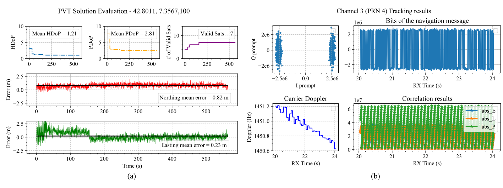

# GALILEO-SDR-SIM

GALILEO-SDR-SIM generates Galileo baseband signal data streams, which can be converted to RF using software-defined radio (SDR) platforms.

- Galileo E1B/C signal generation
- Real time navigation message relay
- Real time location update
- USRP TX support 
- File sink

## Requirements

1. g++
2. Cmake
3. Curses
4. UHD (usrp api and dev library)
5. Boost
6. pynput (optional, for real-time location update via keyboard)

```
sudo apt-get install -y libuhd-dev uhd-host gnss-sdr g++ libncurses-dev cmake pkg-config libboost-dev libglib2.0-dev build-essential
pip3 install pynput
```

For offline evaluation, you will also need GNSS-SDR - found here -> https://gnss-sdr.org/

GNSS-SDR installation with package manager on most Linux distros
```
sudo apt install gnss-sdr
```
For more installation options please check their website.
## Installation
```
git clone https://github.com/harshadms/galileo-sdr-sim
cd galileo-sdr-sim
mkdir build && cd build
cmake ../
make
```

## Execution

Usage, help and options
```
Usage: ./usrp_galileo [options]
Options:
  -e <Ephemeris>   RINEX navigation file for Galileo ephemerides (required)
  -o <File sink>   File to store IQ samples (default: ./galileosim.ishort)
  -u <user_motion> User motion file (dynamic mode)
  -l <location>    Lat,Lon,Hgt (static mode) e.g. 35.274,137.014,100
  -t <date,time>   Scenario start time YYYY/MM/DD,hh:mm:ss
  -T <date,time>   Overwrite TOC and TOE to scenario start time
  -d <duration>    Duration [sec] (default: 300)
  -a <rf_gain>     Absolute RF gain in [0 ... 60] (default: 30)
  -U <use usrp>    Disable USRP (-U 1) (default: true)
  -b <bitstream>   Disable Bit stream (-b 1) (default: true)
  -v <verbose>     Enable verbose output (default: false)
```

Executing the following command will generate a Galileo signal file for the location -6,51,100 starting from 2021/06/20,00:00:00. The generated samples will be stored in **/tmp/galileosim.bin** as interleaved shorts (I<sub>1</sub>Q<sub>1</sub>, I<sub>2</sub>Q<sub>2</sub>, ... , I<sub>n</sub>Q<sub>n</sub>) @ 2.6e6 samples/sec

```
$ ./usrp_galileo -l -6,51,100 -e ../rinex_files/week171.rnx -o /tmp/galileosim.bin -U 1 -b 1 -d 120;
```
I/NAV message generation is still under testing. If you want to use pre-computed messages, please use v1.0.0.
## Evaluation

```
* This is old evaluation. Please wait for new evaluations.
```

The generated E1B/C signal has been tested with GNSS-SDR and a battery of receivers from u-Blox and Septentrio. Here are some evaluation results.



eval methodology - [add gnss-sdr instructions and USRP instructions]

## Future work

Here you will find all improvement plans and pending tasks. Please feel free to add suggestions and contribute :)

- [x] I/NAV message generation (generate_frame.cpp has some PoC)
- [x] RINEX reader integration
- [ ] Test I/NAV message generation with different rinex files with varring PVT
- [ ] Time & Frequency sync with GNSS-SDR monitor
- [ ] Enable multi-SDR support (libhackrf, LimeSuite etc)
- [ ] Fixed point arithmatic to avoid rounding errorss

More ambitious plans:

- [ ] Integrate GPS L1 C/A

#### Acknowledgements
- <a href="https://github.com/osqzss/gps-sdr-sim">GPS-SDR-SIM</a> has been an inspiration to start this project

To cite:
```
@inproceedings{sathaye2023galileo,
  title={Galileo-SDR-SIM: An Open-Source Tool for Generating Galileo Satellite Signals},
  author={Sathaye, Harshad and Motallebighomi, Maryam and Ranganathan, Aanjhan},
  booktitle={Proceedings of the 36th International Technical Meeting of the Satellite Division of The Institute of Navigation (ION GNSS+ 2023)},
  pages={3470--3480},
  year={2023}
}
```
